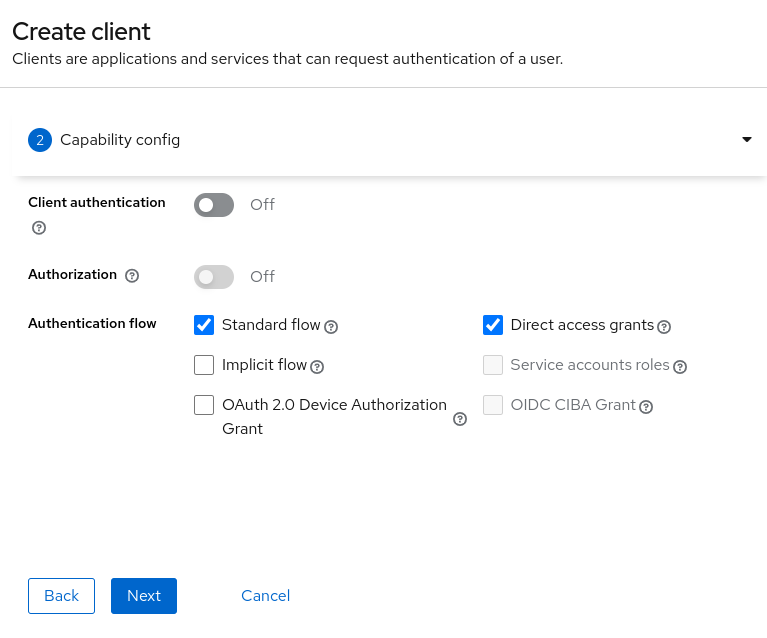

# Microprofile JWT example

This project is an example of using [Microprofile JWT](https://github.com/eclipse/microprofile/wiki/JWT_Auth) with [Wildfly](https://www.wildfly.org/) and [Keycloak](https://www.keycloak.org/). The application will use the jar plugin to generate a full wildfly bootable jar.

The application is just a hello world jax-rs backend which is protected via the Microprofile-JWT `MP-JWT` authentication method. The method is only allowed to users with a role `user` assigned. The index page uses the `keycloak.sh` to do the login, logout, present some basic information and call the hello endpoint. 

# Keycloak preparation

The application needs a realm in Keycloak with some data included. So first download and start a Keycloak server or use the docker image in quay.

```bash
docker run --rm -p 8080:8080  -e KEYCLOAK_ADMIN=admin -e KEYCLOAK_ADMIN_PASSWORD=admin quay.io/keycloak/keycloak start-dev
```

Once started access to the keycloak console in `http://localhost:8080` and login with the administrator username and credentials passed in the startup line. Follow the next steps:

1. Create a new realm called `demo`.

2. In `Realm Roles` create a role called `user`.

3. In `Users` add a user called `validuser`.

4. Set a password to the user.

5. Assign the role `user` to this user.

6. Create another user called `invaliduser`, set a password but do not assign any role to this user.
7. In clients create a client called `microprofile-jwt`. Client next.

8. Set defaults in this second page and client next.

9. In the login settings the application is going to be deployed in `https://localhost:8081` as a root application. Save.

10. In the `Client Scopes` change `microprofile-jwt` from `Optional` to `Default`. This scope adds the `upn` (username) and `groups` (roles assigned to the user) claims into the token used by the framework.


# Application preparation

If the keycloak steps have been executed successfully the application can be packaged.

```bash
mvn clean package
```

The `wildfly-jar-maven-plugin` generates a bootable jar that starts the application in port 8081.

```bash
java -jar target/microprofile-jwt-bootable.jar
```

# Demo

Open a browser and go to `http://localhost:8081`. Click login and login with `validuser`. This user can call the hello endpoint.


If you logout and login again with the `invaliduser` the call to hello fails because this user is not assigned to the `user` role.


